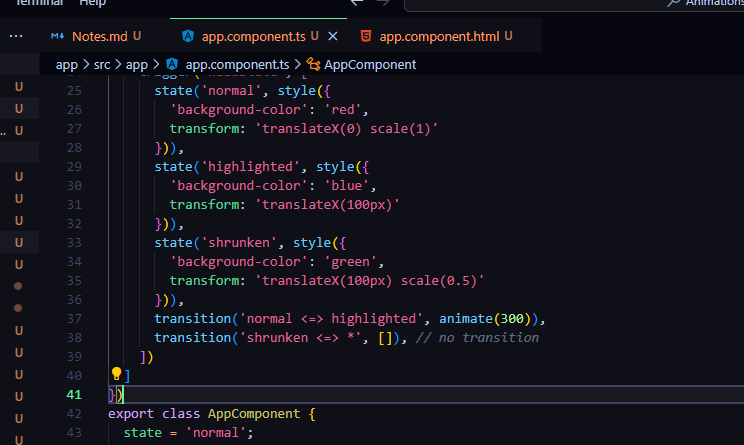

# Angular Animations

## Module Introduction

With the release of Angular 4, the general syntax of Angular Animations didn't change. 

However, the animation functions were moved into their own package and you now also need to add a special module to your imports[] array in the AppModule.

Specifically, the following adjustments are required:

You probably need to install the new animations package (running the command never hurts): npm install --save @angular/animations 
Add the BrowserAnimationsModule to your imports[] array in AppModule
This Module needs to be imported from @angular/platform-browser/animations' => import { BrowserAnimationsModule } from '@angular/platform-browser/animations' (in the AppModule!)
You then import trigger , state , style etc from @angular/animations instead of @angular/core 
That's all!

## Setting up a starting project

In the app components under the empty buttons, in the divs, we will show how the animations work.

## Animations Triggers and state

Animations are mainly typescript files. 

## Switching between states

Make sure you use the same property names in things, otherwise it WONT WORK!

## Transitions

## Advanced transitions

* = means any state

***********************************
## Transition Phases

## The "void" State

## Using Keyframes for Animations

## Grouping Transitions

## Using Animation Callbacks

***********************************
# Adding Offline Capabilities with Service Workers

## Module Introduction

## Adding Service Workers

## Caching Assets for Offline Use

## Caching Dynamic Assets & URLs

